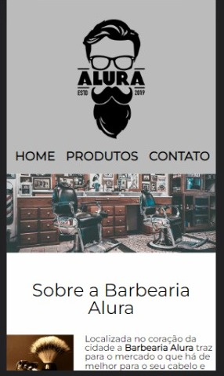
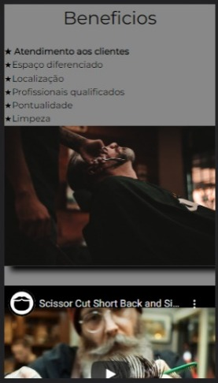

# Barber
Um site bonito e organizado da barbearia Alura
<h1 align="center"> Barbearia Alura </h1>

 
  

<h2> Descrição do Projeto </h2>

 Site desenvolvido apartir de estudos na plataforma Alura, afim de aprimorar habilidades iniciais em HTML5 e CSS3. 

 Barbearia Alura é um site bonito e bem organizado com designer simples e moderno.

## ✂️ O site é dividido em três paginas

- `Pagina 1 - home`: Pagina inicial do site
- `Pagina 2 - Produtos`: Pagina do catalogo do tipos de cortes
- `Pagina 2 - Contato`: Pagina para contato, pagina para o cliente se comunicar com a empresa, tirar duvidas sobre os produtos, agendar horarios

## Ainda foi possivel desenvolver a versão mobile

  
  

